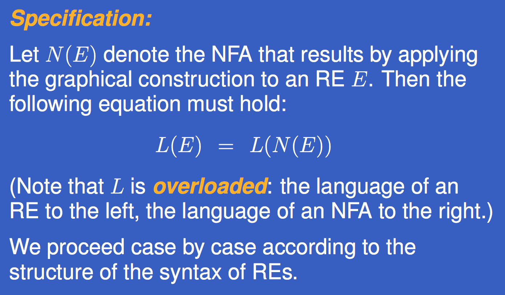

# Language and Computation

## DFA

### Definition

### The Extended Transition Function

### The Language of a DFA

## NFA

### Definition

### The Extended Transition Function

### Language of NFA

## Subset Construction

### Observations

### Core Process

### NFA and DFA

## Regualr Expression

### NFA/DFA <=> Regular Expressions

### Syntax

### Regular Expression => NFA

### Before Convert

### Core Process

#### Empty Set

#### Empty Word

#### Single Character

#### E + F

#### EF

#### E*

#### (E)

## Non-regular Language

### CFG

#### Definition

#### Example of CFG

###  Derivation of CFG

#### Directly derives relation

#### Derives relation

### Context-Free Language

### Derivation Tree

